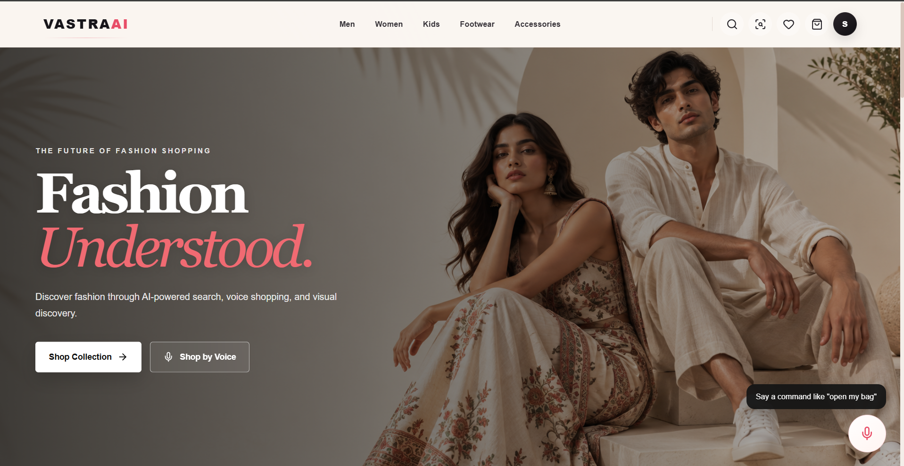
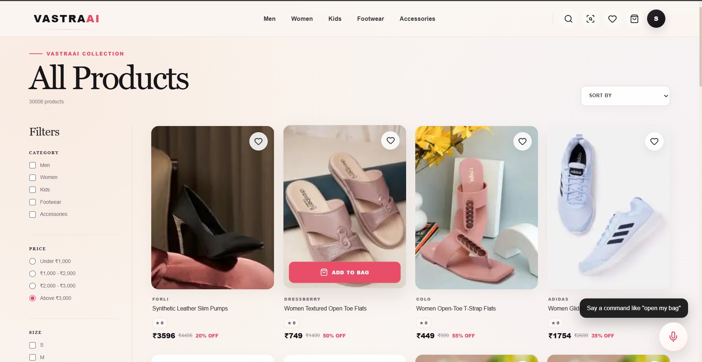
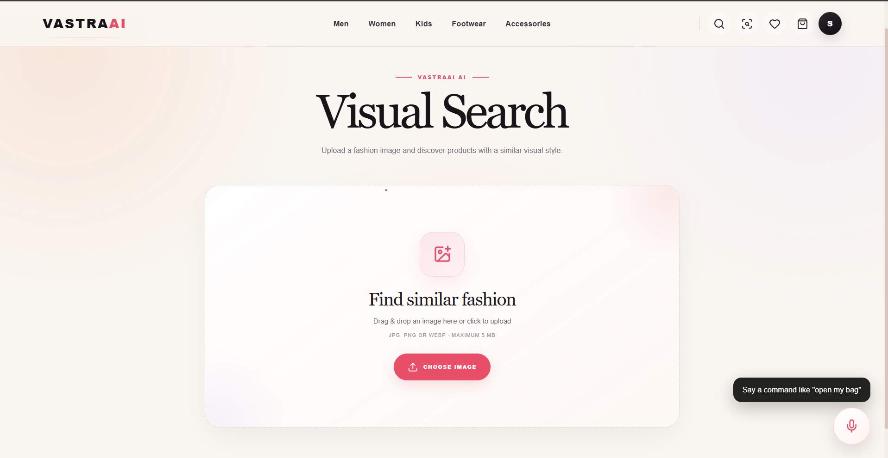
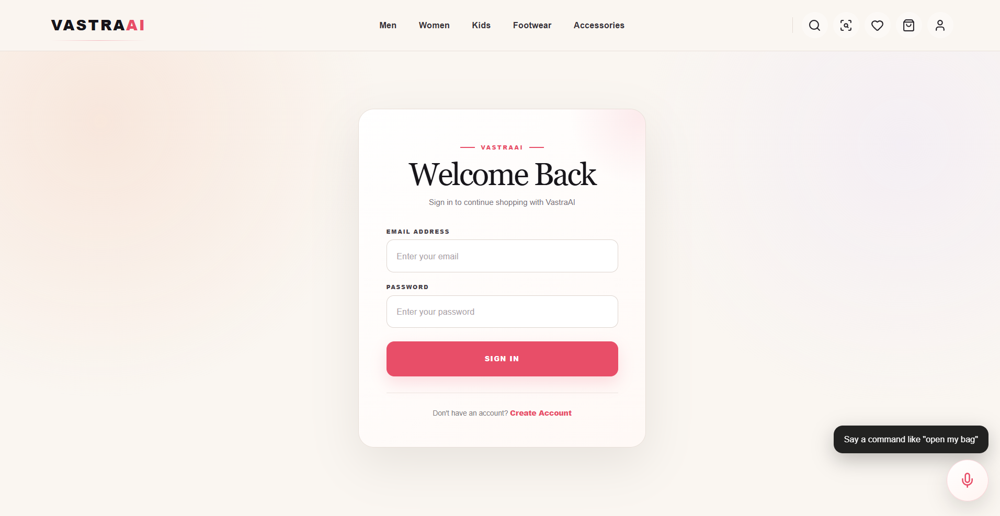
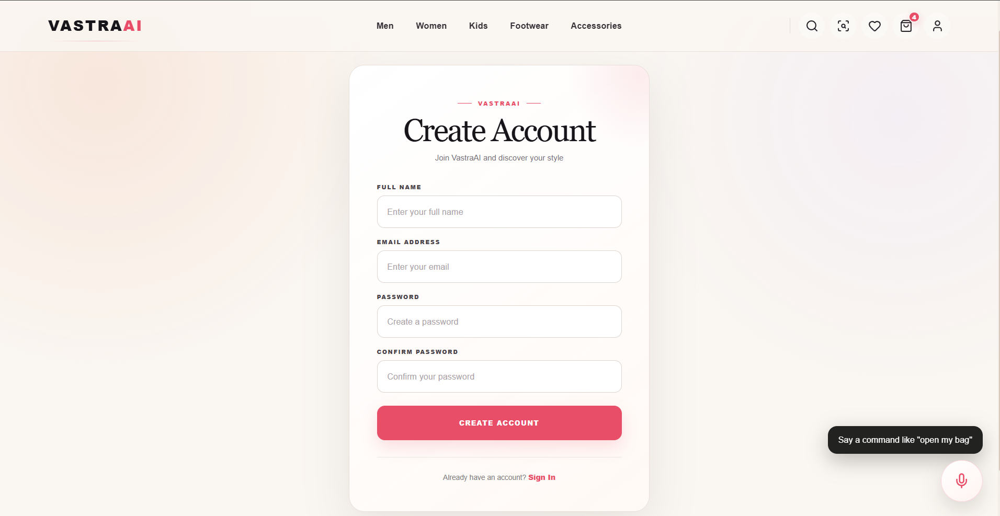
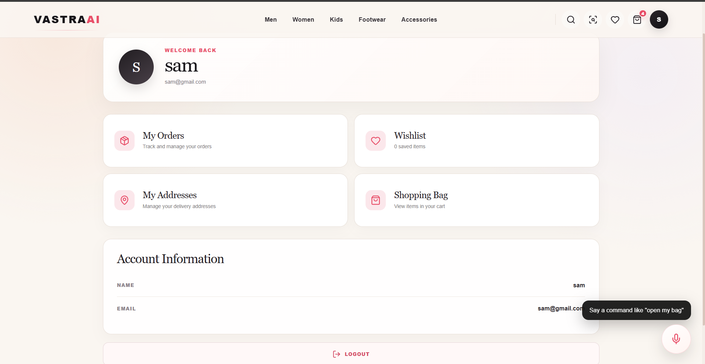
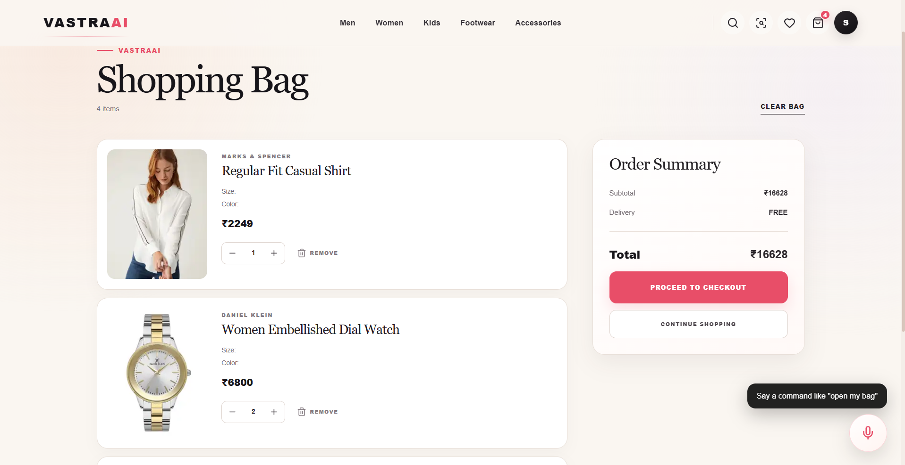
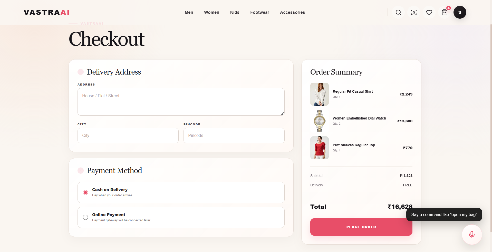
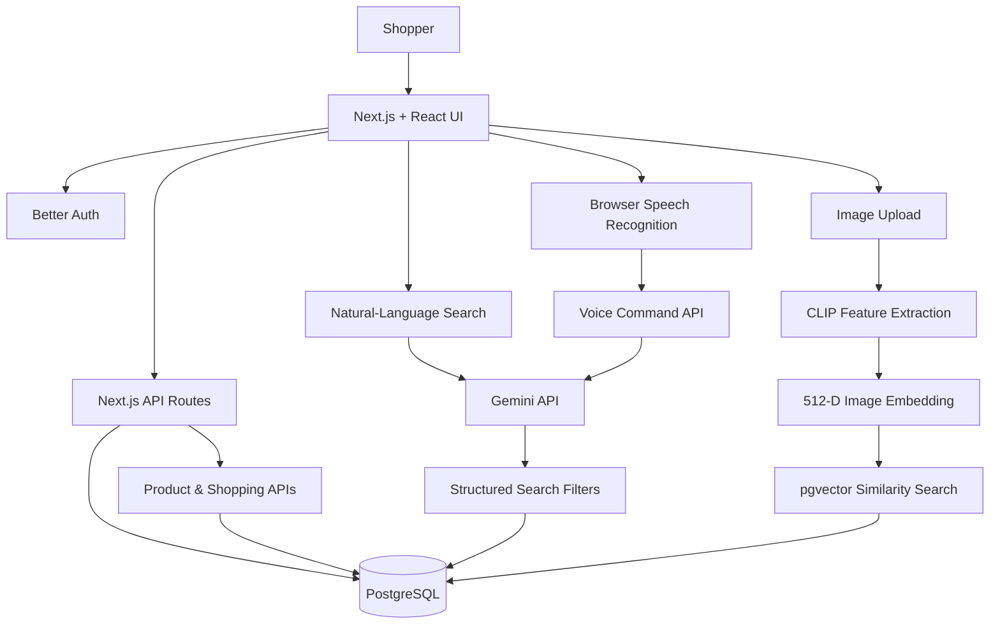
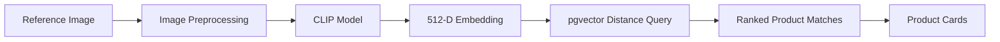

<p align="center">
  
</p>

<h1 align="center">VastraAI ✨</h1>

<h3 align="center">
  Discover Fashion. Search Smarter. Shop with AI.
</h3>

<p align="center">
  An AI-powered fashion e-commerce platform that combines intelligent
  product discovery, visual similarity search, and voice-assisted shopping
  in one modern shopping experience.
</p>

<p align="center">
  <a href="https://vastra-ai-beta.vercel.app">
    
  </a>
  <a href="https://github.com/Sujaltonge384/VastraAI">
    
  </a>
</p>

<p align="center">
  
  
  
  
  
  
  
</p>

---

## 💫 The Idea Behind VastraAI

Imagine finding the perfect outfit without scrolling through hundreds of products.

What if you could describe the clothes you want, upload a picture for inspiration, or simply tell your shopping assistant what to do?

**That is the experience VastraAI aims to create.**

VastraAI is a full-stack fashion shopping application that brings together traditional e-commerce functionality and AI-powered discovery. Instead of relying only on keywords and filters, users can explore products through natural-language queries, visual similarity search, and a voice-driven shopping assistant.

The project combines a modern web application, a relational database, AI model inference, and vector search in one integrated system.

<p align="center">
  <strong>🛍️ E-commerce &nbsp;·&nbsp; 🧠 Generative AI &nbsp;·&nbsp; 🖼️ Computer Vision &nbsp;·&nbsp; 🎙️ Voice Interaction</strong>
</p>

---

## ⚡ What Makes VastraAI Different?

<table>
  <tr>
    <td width="50%" valign="top">
      <h3>🧠 AI-Powered Search</h3>
      Describe what you want in everyday language. Gemini interprets product types, colours, budgets, sizes, and sorting preferences to help retrieve relevant products.
    </td>
    <td width="50%" valign="top">
      <h3>🖼️ Visual Similarity Search</h3>
      Upload a reference image and discover visually similar products using CLIP image embeddings and PostgreSQL vector similarity search.
    </td>
  </tr>
  <tr>
    <td width="50%" valign="top">
      <h3>🎙️ Voice Shopping Assistant</h3>
      Use microphone-based commands for supported shopping operations, navigation, cart management, and checkout shortcuts.
    </td>
    <td width="50%" valign="top">
      <h3>💗 Modern Shopping Experience</h3>
      Explore product cards, product details, a shopping bag, wishlist, checkout, addresses, and order history through a responsive web interface.
    </td>
  </tr>
  <tr>
    <td width="50%" valign="top">
      <h3>🔔 Instant Action Feedback</h3>
      Shared toast notifications provide visible feedback when supported cart and wishlist actions succeed.
    </td>
    <td width="50%" valign="top">
      <h3>☁️ Full-Stack Deployment</h3>
      A production-deployed Next.js application connecting API routes, authentication, PostgreSQL, and AI-powered services.
    </td>
  </tr>
</table>

---

## 🚀 Explore the Features

### 1. 🔎 Search by Meaning, Not Just Keywords

Traditional product search often requires users to know the exact product name.

VastraAI adds a natural-language search layer powered by Gemini.

**Try queries like:**

- `Show black shirts under 1500`
- `Find blue jeans`
- `Show the cheapest sneakers`
- `Find the best-rated shirts`
- `Show white dresses in size M`

The AI converts the request into structured search criteria, which are then used to query the product catalogue.

### 2. 🖼️ Find Products Using an Image

Sometimes it is easier to show what you want than to describe it.

VastraAI's visual-search pipeline uses the CLIP image-feature model to represent an uploaded image as a numerical embedding. PostgreSQL with pgvector compares that embedding with stored product embeddings and ranks the nearest matches.

**How it works:**

1. Upload a product or outfit reference image.
2. The server processes the image using CLIP.
3. A 512-dimensional image embedding is generated.
4. The embedding is compared with stored product vectors.
5. The API returns up to 20 matching products.

**Visual-search implementation:**

| Component | Implementation |
|---|---|
| Image model | `Xenova/clip-vit-base-patch32` |
| Model library | Hugging Face Transformers.js |
| Inference configuration | `q4` quantized model |
| Embedding dimension | 512 |
| Vector database | PostgreSQL with pgvector |
| Similarity ranking | Vector distance ordering |
| API route | `/api/ai/visual-search` |

The production endpoint has been tested with a real image upload and returned `HTTP 200` with 20 product results. The relevance of the matches depends on the image and the embeddings available in the catalogue.

### 3. 🎙️ Shop with Your Voice

VastraAI includes a floating microphone control connected to a voice-command pipeline.

The browser's Web Speech API captures speech, and the application converts the recognized command into a supported shopping action. Gemini is used to interpret commands that require contextual understanding.

**Example commands:**

| Say this | Intended action |
|---|---|
| “Open my bag” | Navigate to the shopping cart |
| “Go to women's collection” | Open the women's product collection |
| “Show me black shirts” | Search for black shirts |
| “Add this product to my bag” | Add the current product to the cart |
| “Remove this product from my bag” | Remove a matching cart item |
| “Open my wishlist” | Navigate to saved products |
| “Go to checkout” | Open the checkout page |

The assistant also contains handlers for supported quantity updates and checkout shortcuts.

> Voice recognition depends on browser support, microphone permissions, and the command being recognized correctly. Sign-in is required for authenticated shopping actions.

### 4. 🛍️ Complete Shopping Workflows

Beyond AI, the application brings together the main parts of a fashion shopping experience:

- Product catalogue and product detail pages
- Product search and category browsing
- Email/password authentication
- Cart and quantity management
- Wishlist management
- Saved delivery addresses
- Checkout and order history
- Toast notifications for shopping actions

---

## 📸 Screenshots

### 🏠 Homepage



### 🛍️ Product Listing



### 🖼️ AI Visual Search



### 🔐 Login



### 📝 Register



### 👤 User Profile



### 🛍️ Shopping Bag



### 💳 Checkout



---

## 🧰 Tech Stack

<table>
  <tr>
    <th>Layer</th>
    <th>Technology</th>
    <th>Purpose</th>
  </tr>
  <tr>
    <td>Frontend</td>
    <td>Next.js 16, React 19, TypeScript</td>
    <td>Application UI, App Router, client interactions</td>
  </tr>
  <tr>
    <td>Styling</td>
    <td>CSS Modules, global CSS</td>
    <td>Component styling and responsive layouts</td>
  </tr>
  <tr>
    <td>Client state</td>
    <td>Zustand</td>
    <td>Cart, wishlist, and toast state</td>
  </tr>
  <tr>
    <td>Authentication</td>
    <td>Better Auth</td>
    <td>Email/password authentication and sessions</td>
  </tr>
  <tr>
    <td>Database</td>
    <td>PostgreSQL</td>
    <td>Products, users, carts, wishlists, addresses, and orders</td>
  </tr>
  <tr>
    <td>ORM</td>
    <td>Prisma</td>
    <td>Database models, migrations, and typed access</td>
  </tr>
  <tr>
    <td>Generative AI</td>
    <td>Google Gemini API</td>
    <td>Natural-language search and voice-command interpretation</td>
  </tr>
  <tr>
    <td>Computer vision</td>
    <td>CLIP, Transformers.js</td>
    <td>Image-feature extraction and embeddings</td>
  </tr>
  <tr>
    <td>Vector retrieval</td>
    <td>pgvector</td>
    <td>Ranking products by image-embedding distance</td>
  </tr>
  <tr>
    <td>Speech</td>
    <td>Web Speech API</td>
    <td>Browser-based speech recognition</td>
  </tr>
  <tr>
    <td>Deployment</td>
    <td>Vercel</td>
    <td>Production hosting and deployment</td>
  </tr>
</table>

---

## 🧠 System Architecture

The application follows a full-stack architecture in which the browser communicates with Next.js API routes, which coordinate database access and AI functionality.



### 🔬 Visual-search pipeline



---

## 📁 Project Structure

```text
VastraAI/
│
├── data/
│   └── vastra_products_ready.csv
│
├── prisma/
│   ├── migrations/
│   ├── schema.prisma
│   └── seed.ts
│
├── scripts/
│   ├── import-products.ts
│   ├── generate_visual_embeddings.ts
│   ├── test_visual_embedding.ts
│   └── test_visual_embedding.py
│
├── public/
│   ├── Categories/
│   └── hero-fashion.png
│
├── src/
│   ├── app/
│   │   ├── api/
│   │   │   ├── ai/
│   │   │   │   ├── search/
│   │   │   │   ├── voice/
│   │   │   │   └── visual-search/
│   │   │   ├── auth/
│   │   │   ├── cart/
│   │   │   ├── products/
│   │   │   └── wishlist/
│   │   │
│   │   ├── products/
│   │   ├── search/
│   │   ├── visual-search/
│   │   ├── cart/
│   │   ├── wishlist/
│   │   ├── checkout/
│   │   └── orders/
│   │
│   ├── components/
│   │   ├── Navbar/
│   │   ├── ProductCard/
│   │   ├── ProductActions/
│   │   ├── Toast/
│   │   └── VoiceShopping.tsx
│   │
│   ├── lib/
│   │   ├── auth.ts
│   │   ├── prisma.ts
│   │   ├── clip.ts
│   │   └── productSearch.ts
│   │
│   └── store/
│       ├── authStore.ts
│       ├── cartStore.ts
│       ├── wishlistStore.ts
│       ├── orderStore.ts
│       └── toastStore.ts
│
├── next.config.ts
├── prisma.config.ts
├── package.json
└── README.md
```

---

## ⚙️ Getting Started

Want to run VastraAI locally? Follow these steps.

### ✅ Prerequisites

Before getting started, install or configure:

- Node.js compatible with Next.js 16
- npm
- PostgreSQL
- A PostgreSQL database with the pgvector extension enabled
- A Google Gemini API key for AI search and voice interpretation

### 1. Clone the repository

```bash
git clone https://github.com/Sujaltonge384/VastraAI.git

cd VastraAI
```

### 2. Install dependencies

```bash
npm install
```

### 3. Configure environment variables

Copy the example environment file.

**Windows PowerShell:**

```powershell
Copy-Item .env.example .env
```

**macOS / Linux:**

```bash
cp .env.example .env
```

Open `.env` and replace the placeholder values with your own credentials.

| Variable | Description |
|---|---|
| `DATABASE_URL` | PostgreSQL connection string |
| `BETTER_AUTH_URL` | Application base URL, such as `http://localhost:3000` |
| `BETTER_AUTH_SECRET` | Long, randomly generated authentication secret |
| `GEMINI_API_KEY` | Google Gemini API key |

Never commit your real `.env` file or expose production secrets.

### 4. Prepare PostgreSQL and pgvector

Ensure the pgvector extension is installed and enabled for your database.

If your PostgreSQL provider supports it and it has not already been enabled, execute:

```sql
CREATE EXTENSION IF NOT EXISTS vector;
```

Generate Prisma Client and apply the database migrations:

```bash
npx prisma generate

npx prisma migrate dev
```

Use a separate development database when running development migrations.

### 5. Import the product catalogue (optional)

The repository contains a product dataset at:

`data/vastra_products_ready.csv`

If your database is empty and you want to import the catalogue, run:

```bash
npx tsx scripts/import-products.ts
```

Skip this step if the database already contains the product catalogue.

### 6. Generate visual embeddings (optional)

Visual search requires embeddings to be stored for products in the database.

After the product data is available and pgvector has been configured, run:

```bash
npx tsx scripts/generate_visual_embeddings.ts
```

This process loads the CLIP model, processes product images, and stores their embeddings. It may take time and computing resources for a large catalogue.

You do not need to regenerate embeddings every time you start the application.

### 7. Start the development server

```bash
npm run dev
```

Open:

**http://localhost:3000**

---

## 🔌 Key API Routes

| Route | Method | Purpose |
|---|---|---|
| `/api/ai/search` | POST | Parse a natural-language product query and return matching products |
| `/api/ai/voice` | POST | Interpret a recognized voice command |
| `/api/ai/visual-search` | POST | Generate an image embedding and return similar products |
| `/api/auth/[...all]` | GET / POST | Better Auth handler |
| `/api/products` | GET | Retrieve and search the product catalogue |
| `/api/cart` | GET / POST | Read the cart or add items |
| `/api/wishlist` | GET / POST / DELETE | Read or modify wishlist items |

The route implementations live under `src/app/api/`.

---

## 🌐 Live Demo

<p align="center">
  <a href="https://vastra-ai-beta.vercel.app">
    
  </a>
</p>

Explore the application:

- **Storefront:** https://vastra-ai-beta.vercel.app/
- **Products:** https://vastra-ai-beta.vercel.app/products
- **Search:** https://vastra-ai-beta.vercel.app/search
- **Visual search:** https://vastra-ai-beta.vercel.app/visual-search
- **Cart:** https://vastra-ai-beta.vercel.app/cart
- **Wishlist:** https://vastra-ai-beta.vercel.app/wishlist

Some routes and shopping actions require you to sign in.

---

## 🚀 Deployment

VastraAI is configured for deployment on Vercel.

Before deploying:

1. Configure the production environment variables.
2. Ensure the production PostgreSQL database is reachable.
3. Confirm that pgvector is enabled and product embeddings are populated.
4. Verify the Better Auth base URL.
5. Deploy and inspect the build and runtime logs.
6. Test authentication, product browsing, cart, wishlist, and AI endpoints.

The visual-search route explicitly traces the ONNX Runtime packages in `next.config.ts` so that the required server-side runtime files are included in the deployment.

---

## 🧪 Verification & Project Status

| Area | Status |
|---|---|
| Production deployment | Live |
| Product catalogue API | Implemented |
| Natural-language search API | Implemented |
| Visual-search API | Manually tested; returned HTTP 200 with 20 results |
| Authentication | Integrated with Better Auth |
| Cart and wishlist | Integrated with API routes and client state stores |
| Voice shopping | Implemented for supported commands; browser testing recommended |
| Voice cart/wishlist toast feedback | Integrated; verify both flows in the live browser |
| Full UI screenshot gallery | Screenshots still need to be captured and added |

Feature status may evolve as the application continues to be tested and improved.

---

## 🛠️ Useful Development Commands

```bash
# Install dependencies
npm install

# Run the development server
npm run dev

# Run ESLint
npm run lint

# Generate Prisma Client
npx prisma generate

# Apply development migrations
npx prisma migrate dev

# Build the production application
npm run build

# Start the production build locally
npm run start
```

---

## 🔮 Future Improvements

Potential directions for further development include:

- 👗 Personalized outfit and style recommendations
- 🧥 AI-generated outfit combinations
- 🎯 Improved relevance evaluation for visual search
- 🧠 More context-aware voice shopping
- 📱 Further mobile UX improvements
- 📊 Product discovery analytics
- 🧪 Automated tests for cart, wishlist, voice, and search flows

These are potential improvements, not claims that every item is already implemented.

---

## 👨‍💻 About the Project

VastraAI was built to explore how full-stack engineering, generative AI, computer vision, and vector search can work together in a practical consumer application.

The project involves designing user-facing shopping flows, implementing API routes, modelling relational data, integrating AI services, and solving real production deployment issues.

**The goal is simple: make fashion discovery feel more natural, visual, and interactive.**

<p align="center">
  <strong>VastraAI</strong><br />
  <em>Fashion meets intelligence.</em>
</p>

<p align="center">
  <a href="https://github.com/Sujaltonge384/VastraAI">GitHub Repository</a>
  &nbsp; · &nbsp;
  <a href="https://vastra-ai-beta.vercel.app">Live Demo</a>
</p>
