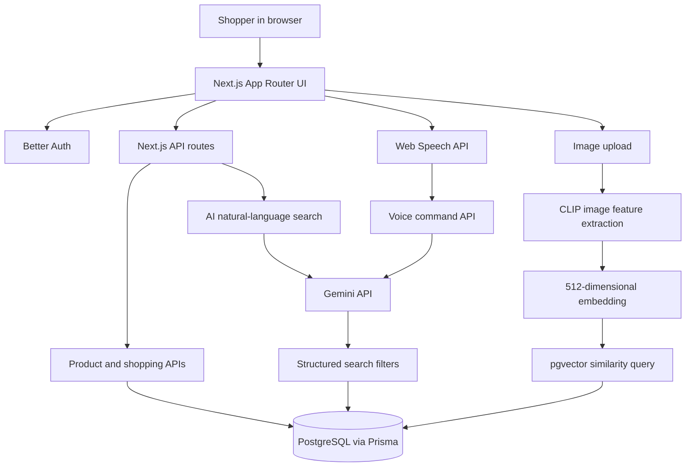

<p align="center">
  
</p>

<h1 align="center">VastraAI</h1>

<p align="center">
  <strong>AI-powered fashion discovery and e-commerce</strong><br />
  Search with natural language, find visually similar products, and shop with voice-assisted controls.
</p>

<p align="center">
  <a href="https://vastra-ai-beta.vercel.app"><strong>Live Demo</strong></a>
  ·
  <a href="https://github.com/Sujaltonge384/VastraAI"><strong>Source Code</strong></a>
</p>

<p align="center">
  
  
  
  
  
</p>

## Overview

**VastraAI** is a full-stack fashion shopping application that combines familiar e-commerce workflows with AI-based product discovery. In addition to browsing a product catalogue, shoppers can describe what they want in everyday language, upload a reference image to discover similar products, and use a microphone-driven assistant for supported shopping commands.

The application is built with the Next.js App Router and TypeScript. PostgreSQL stores the product catalogue and shopping data; Prisma manages database access; Gemini powers natural-language understanding; and CLIP embeddings with pgvector power visual similarity search.

> **Live demo:** [vastra-ai-beta.vercel.app](https://vastra-ai-beta.vercel.app)

## Features

### AI product discovery

- **Natural-language search:** Describe an item or set of preferences in a sentence, such as “black shirts under ₹1,500” or “best-rated sneakers.” Gemini converts the request into structured filters that are applied to the product catalogue.
- **Visual similarity search:** Upload a product or outfit image to retrieve visually similar catalogue items. The backend uses the CLIP image-feature model and ranks products using vector similarity in PostgreSQL with pgvector.
- **Product browsing:** Browse the catalogue and product details, with category and product search flows.
- **Voice shopping assistant:** Use the microphone control to issue supported commands for navigation, product search, cart changes, quantity updates, and checkout shortcuts. Speech recognition depends on browser support and microphone permission.
- **Shopping workflows:** Email/password authentication, bag/cart, wishlist, addresses, checkout, and order history.
- **Action feedback:** Shared top-right toast notifications provide visible confirmation for supported cart and wishlist actions. Voice-triggered actions use the same notification store when the action is successfully recognized and completed.

### Visual search details

The visual-search implementation uses:

- **Model:** `Xenova/clip-vit-base-patch32` via `@huggingface/transformers`
- **Inference dtype:** `q4` quantized model configuration
- **Embedding size:** 512 values per image embedding
- **Retrieval:** PostgreSQL + pgvector distance ordering
- **Response:** Up to 20 nearest product matches

The production visual-search endpoint was manually tested with an image upload and returned `HTTP 200` with 20 product results. Similarity quality depends on the available catalogue and the visual embeddings stored in the database.

## Demo walkthrough

Start with the live site, then try these flows:

| Flow | What to try | Open |
| --- | --- | --- |
| Storefront | Explore the fashion landing page and categories. | [Home](https://vastra-ai-beta.vercel.app/) |
| Product catalogue | Browse products and open a product detail page. | [Products](https://vastra-ai-beta.vercel.app/products) |
| Natural-language search | Search with a phrase containing product type, colour, price, size, or sort preference. | [Search](https://vastra-ai-beta.vercel.app/search) |
| Visual search | Upload a clear product image and inspect the matching results. | [Visual Search](https://vastra-ai-beta.vercel.app/visual-search) |
| Cart and checkout | Add a product, then review the bag and checkout flow. | [Cart](https://vastra-ai-beta.vercel.app/cart) |
| Wishlist | Save products and review saved items. | [Wishlist](https://vastra-ai-beta.vercel.app/wishlist) |
| Voice assistant | Use the floating microphone control and try a supported command on a product page. | [Live Demo](https://vastra-ai-beta.vercel.app/) |

Some shopping actions require signing in. Voice recognition works only in browsers that provide the required Web Speech API and when microphone access is allowed.

## Screenshots

The repository currently contains the fashion artwork used by the application, but **does not yet contain captured screenshots of the rendered application pages**. The cover image above is artwork—not a fabricated browser screenshot. Add screenshots from the live or local app here when available.

Suggested screenshot gallery:

| Screenshot to capture | What it should demonstrate | Save as |
| --- | --- | --- |
| Home page | Navigation, hero area, categories, and featured products | `docs/screenshots/home.png` |
| Product catalogue | Product cards, prices, ratings, and browsing controls | `docs/screenshots/products.png` |
| AI visual search | Uploaded reference image and returned matching products | `docs/screenshots/visual-search.png` |
| Voice shopping | Floating microphone and recognized command | `docs/screenshots/voice-shopping.png` |
| Cart confirmation | Top-right toast showing a product name after a voice action | `docs/screenshots/voice-cart-toast.png` |
| Wishlist confirmation | Wishlist state and top-right confirmation toast | `docs/screenshots/voice-wishlist-toast.png` |

To add them, create `docs/screenshots/`, save genuine screenshots using the filenames above, then embed them with Markdown, for example:

```md

```

## Technology stack

| Layer | Technology | Role |
| --- | --- | --- |
| Web application | Next.js 16, React 19, TypeScript | App Router pages, UI, and server routes |
| Styling | CSS Modules and global CSS | Component styling and responsive layouts |
| Client state | Zustand | Cart, wishlist, and toast state |
| Authentication | Better Auth | Email/password sign-in and sessions |
| Database | PostgreSQL | Products, users, carts, wishlists, addresses, and orders |
| ORM | Prisma | Typed database access and migrations |
| Vector search | pgvector | Similarity ranking over image embeddings |
| AI text understanding | Google Gemini API (`gemini-3.1-flash-lite`) | Natural-language product search and voice-command parsing |
| Image features | Hugging Face Transformers.js + CLIP | 512-dimensional image embeddings |
| Speech input | Browser Web Speech API | Microphone input and speech transcription |
| Deployment | Vercel | Production hosting |

## Architecture



At a high level, the browser handles the interactive shopping experience. Next.js API routes validate requests and coordinate with authentication, Gemini, CLIP inference, and PostgreSQL. Visual search compares the query image embedding against the product embeddings already stored in the database.

## Repository structure

```text
VastraAI/
├── data/
│   └── vastra_products_ready.csv   # Product catalogue source data
├── prisma/
│   ├── migrations/                 # Database migration history
│   └── schema.prisma               # PostgreSQL data model
├── scripts/
│   ├── import-products.ts          # Import product rows from CSV
│   └── generate_visual_embeddings.ts
├── src/
│   ├── app/                        # Pages and API routes
│   │   └── api/ai/                  # Gemini and visual-search handlers
│   ├── components/                 # Product UI, voice assistant, toast, navbar
│   ├── lib/                        # Auth, Prisma, CLIP, product search helpers
│   └── store/                      # Zustand cart, wishlist, and toast stores
├── next.config.ts
├── prisma.config.ts
└── package.json
```

## Getting started

### Prerequisites

- Node.js compatible with the project's Next.js version
- npm
- A PostgreSQL database
- A Google Gemini API key for AI text and voice features
- A PostgreSQL instance with the **pgvector** extension enabled for visual search

### 1. Clone and install

```bash
git clone https://github.com/Sujaltonge384/VastraAI.git
cd VastraAI
npm install
```

### 2. Configure environment variables

Create a local `.env` file in the project root. Start from the variable names in [`.env.example`](.env.example) and provide your own credentials.

Required variables:

| Variable | Purpose |
| --- | --- |
| `DATABASE_URL` | PostgreSQL connection string |
| `BETTER_AUTH_URL` | Base URL of the application, such as `http://localhost:3000` locally |
| `BETTER_AUTH_SECRET` | Long, random secret used by Better Auth |
| `GEMINI_API_KEY` | API key for Gemini-powered search and voice parsing |

Never commit your real `.env` file or publish API keys.

### 3. Prepare the database

Ensure pgvector is enabled on the target PostgreSQL database. Run the following in your database console if your provider supports it and the extension is not already enabled:

```sql
CREATE EXTENSION IF NOT EXISTS vector;
```

Then generate Prisma Client and apply the migrations:

```bash
npx prisma generate
npx prisma migrate dev
```

Use a separate database for local development. Do not run development migrations against production without reviewing the migration plan.

### 4. Import products (optional)

The repository includes `data/vastra_products_ready.csv`. If your database does not already contain products, import the catalogue:

```bash
npx tsx scripts/import-products.ts
```

Do not rerun the import unnecessarily against a populated database.

### 5. Generate visual embeddings (optional, required for a populated visual-search catalogue)

Visual search needs embeddings saved for products. After importing products and enabling pgvector, run:

```bash
npx tsx scripts/generate_visual_embeddings.ts
```

This process downloads/loads the CLIP model and processes product images. It can take time and resources for a large catalogue, so run it as a one-time data preparation task rather than at every app startup.

### 6. Start the development server

```bash
npm run dev
```

Open [http://localhost:3000](http://localhost:3000).

### Useful development commands

```bash
npm run lint
npm run build
npx prisma generate
npx prisma migrate dev
```

## Key API routes

| Endpoint | Method | Purpose |
| --- | --- | --- |
| `/api/ai/search` | `POST` | Convert natural-language shopping requests into database filters and return products |
| `/api/ai/voice` | `POST` | Convert a recognized voice command into a structured intent |
| `/api/ai/visual-search` | `POST` | Accept an image upload, generate its embedding, and return similar products |
| `/api/auth/[...all]` | `GET/POST` | Better Auth handler |
| `/api/cart` | `GET/POST` | Read or add cart items |
| `/api/wishlist` | `GET/POST/DELETE` | Read or update wishlist items |
| `/api/products` | `GET` | Query the product catalogue |

The route behavior is implemented in `src/app/api/`.

## Deployment

The application is configured for Vercel deployment. Configure the same required environment variables in the Vercel project before deploying:

- `DATABASE_URL`
- `BETTER_AUTH_URL` set to the production site URL
- `BETTER_AUTH_SECRET`
- `GEMINI_API_KEY`

The visual-search route also explicitly traces the ONNX Runtime packages through `next.config.ts`. Test the production build and all authenticated shopping flows after a deployment.

## Current verification

- **Visual-search API:** Manually tested against the deployed endpoint with a sample image; the endpoint returned `HTTP 200` and 20 product results.
- **Voice-triggered toast notifications:** The shared toast store is wired into the supported voice cart/wishlist action handlers. Test both flows in the browser before relying on them in a demo.
- **Full UI screenshot gallery:** Not yet committed; see [Screenshots](#screenshots) for the recommended captures.

## Contributing

For a change:

1. Create a feature branch.
2. Keep credentials in local environment files, never in source control.
3. Run `npm run lint` and `npm run build`.
4. Open a pull request with a clear summary and screenshots for UI changes.

---

<p align="center">
  Built as a full-stack AI fashion e-commerce project.
</p>
